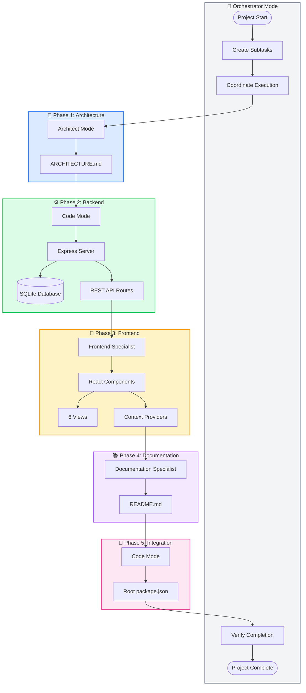

# AI Agent Workflow Documentation

> This document records how Kilo Code AI agents (modes) collaborated to build the TaskFlow project management application. It serves as a transparent record of the orchestrated workflow, agent contributions, and key decisions made during development.

---

## Table of Contents

1. [Overview](#overview)
2. [Feature Updates](#feature-updates)
3. [Agents Used](#agents-used)
4. [Workflow Diagram](#workflow-diagram)
5. [Detailed Agent Contributions](#detailed-agent-contributions)
6. [Key Decisions Made](#key-decisions-made)
7. [Token/Time Estimates](#tokentime-estimates)
8. [Lessons Learned](#lessons-learned)

---

## Overview

**TaskFlow** is a full-stack project management application built entirely through coordinated AI agent collaboration. The project demonstrates how multiple specialized AI modes can work together in sequence to produce a production-ready application.

### Project Summary

- **Type**: Local-first, single-user project management tool
- **Inspiration**: Similar to Jira but simplified for personal use
- **Architecture**: Full-stack with Express backend and React frontend
- **Database**: SQLite for local-first data storage
- **Version**: v1.1.0

### Key Features

- **Project Management**: Create and organize projects with color coding
- **Task Tracking**: Full task lifecycle with status, priority, and due dates
- **People Management**: Contact management with project associations
- **Task Assignments**: Primary assignee and co-assignees with roles
- **Task Tags**: Categorize tasks with global or project-specific tags
- **Multiple Views**: 6 views (Dashboard, Kanban, List, Calendar, Timeline, People)

### AI Collaboration Model

The project was orchestrated through **Orchestrator Mode**, which coordinated multiple distinct subtasks assigned to specialized AI modes. Each mode contributed its expertise in a sequential workflow with clear dependencies.

---

## Feature Updates

### v1.1.0 - People, Tags & Assignees (2026-02-18)

This update adds contact management and task assignment capabilities to TaskFlow.

#### New Features

| Feature | Description |
|---------|-------------|
| **People Management** | Create and manage contacts (not users) with name, email, company, designation, and project association |
| **Task Assignments** | Set primary assignee and co-assignees with roles (collaborator, reviewer, observer) |
| **Task Tags** | Categorize tasks with custom tags that can be global or project-specific |
| **People View** | New dedicated view for managing contacts with search and filtering capabilities |

#### Files Added

| File | Purpose |
|------|---------|
| [`server/routes/people.js`](server/routes/people.js) | People CRUD API endpoints |
| [`server/routes/tags.js`](server/routes/tags.js) | Tags CRUD API endpoints |
| [`client/src/context/PeopleContext.tsx`](client/src/context/PeopleContext.tsx) | People state management context |
| [`client/src/context/TagContext.tsx`](client/src/context/TagContext.tsx) | Tag state management context |
| [`client/src/components/people/PeopleView.tsx`](client/src/components/people/PeopleView.tsx) | People management view component |
| [`client/src/components/common/PersonForm.tsx`](client/src/components/common/PersonForm.tsx) | Person creation/edit form |
| [`client/src/components/common/TagForm.tsx`](client/src/components/common/TagForm.tsx) | Tag creation/edit form |

#### Files Modified

| File | Changes |
|------|---------|
| [`ARCHITECTURE.md`](ARCHITECTURE.md) | Updated schema with people, tags, task_assignees, task_tags tables |
| [`README.md`](README.md) | Added documentation for new features and API endpoints |
| [`server/db/schema.js`](server/db/schema.js) | Added new tables and indexes |
| [`server/db/seed.js`](server/db/seed.js) | Added sample people, tags, and assignments |
| [`server/routes/tasks.js`](server/routes/tasks.js) | Added assignee and tag endpoints |
| [`server/index.js`](server/index.js) | Registered new route handlers |
| [`client/src/types/index.ts`](client/src/types/index.ts) | Added TypeScript interfaces for new entities |
| [`client/src/services/api.ts`](client/src/services/api.ts) | Added API client methods for people and tags |
| [`client/src/context/TaskContext.tsx`](client/src/context/TaskContext.tsx) | Enhanced with assignee and tag support |
| [`client/src/components/common/TaskForm.tsx`](client/src/components/common/TaskForm.tsx) | Added assignee and tag selection fields |
| [`client/src/components/common/Badge.tsx`](client/src/components/common/Badge.tsx) | Enhanced for tag display |
| [`client/src/components/kanban/TaskCard.tsx`](client/src/components/kanban/TaskCard.tsx) | Added assignee and tag display |
| [`client/src/components/list/TaskRow.tsx`](client/src/components/list/TaskRow.tsx) | Added assignee and tag columns |
| [`client/src/components/list/ListView.tsx`](client/src/components/list/ListView.tsx) | Updated with new columns |
| [`client/src/components/list/FilterBar.tsx`](client/src/components/list/FilterBar.tsx) | Added assignee and tag filters |
| [`client/src/components/layout/Sidebar.tsx`](client/src/components/layout/Sidebar.tsx) | Added People navigation item |
| [`client/src/App.tsx`](client/src/App.tsx) | Added People view route |

#### Agents Used for v1.1.0

| Mode | Task | Files Created/Modified |
|------|------|------------------------|
| **Architect** | Schema Design | [`ARCHITECTURE.md`](ARCHITECTURE.md) |
| **Code** | Backend Implementation | [`server/db/schema.js`](server/db/schema.js), [`server/db/seed.js`](server/db/seed.js), [`server/routes/people.js`](server/routes/people.js), [`server/routes/tags.js`](server/routes/tags.js), [`server/routes/tasks.js`](server/routes/tasks.js), [`server/index.js`](server/index.js) |
| **Frontend Specialist** | Frontend Implementation | [`client/src/types/index.ts`](client/src/types/index.ts), [`client/src/services/api.ts`](client/src/services/api.ts), [`client/src/context/PeopleContext.tsx`](client/src/context/PeopleContext.tsx), [`client/src/context/TagContext.tsx`](client/src/context/TagContext.tsx), [`client/src/context/TaskContext.tsx`](client/src/context/TaskContext.tsx), [`client/src/components/people/PeopleView.tsx`](client/src/components/people/PeopleView.tsx), [`client/src/components/common/PersonForm.tsx`](client/src/components/common/PersonForm.tsx), [`client/src/components/common/TagForm.tsx`](client/src/components/common/TagForm.tsx), [`client/src/components/common/TaskForm.tsx`](client/src/components/common/TaskForm.tsx), [`client/src/components/common/Badge.tsx`](client/src/components/common/Badge.tsx), [`client/src/components/kanban/TaskCard.tsx`](client/src/components/kanban/TaskCard.tsx), [`client/src/components/list/TaskRow.tsx`](client/src/components/list/TaskRow.tsx), [`client/src/components/list/ListView.tsx`](client/src/components/list/ListView.tsx), [`client/src/components/list/FilterBar.tsx`](client/src/components/list/FilterBar.tsx), [`client/src/components/layout/Sidebar.tsx`](client/src/components/layout/Sidebar.tsx), [`client/src/App.tsx`](client/src/App.tsx) |
| **Documentation Specialist** | Documentation Update | [`README.md`](README.md) |

#### Database Changes

```sql
-- New people table for contacts
CREATE TABLE people (
    id TEXT PRIMARY KEY,
    name TEXT NOT NULL,
    email TEXT,
    company TEXT,
    designation TEXT,
    project_id TEXT,
    created_at DATETIME,
    updated_at DATETIME,
    FOREIGN KEY (project_id) REFERENCES projects(id)
);

-- New tags table for task categorization
CREATE TABLE tags (
    id TEXT PRIMARY KEY,
    name TEXT NOT NULL,
    color TEXT DEFAULT '#6B7280',
    project_id TEXT,
    created_at DATETIME,
    updated_at DATETIME,
    FOREIGN KEY (project_id) REFERENCES projects(id)
);

-- New task_assignees table for co-assignees
CREATE TABLE task_assignees (
    id TEXT PRIMARY KEY,
    task_id TEXT NOT NULL,
    person_id TEXT NOT NULL,
    role TEXT DEFAULT 'collaborator',
    created_at DATETIME,
    FOREIGN KEY (task_id) REFERENCES tasks(id),
    FOREIGN KEY (person_id) REFERENCES people(id)
);

-- New task_tags table for task-tag relationships
CREATE TABLE task_tags (
    id TEXT PRIMARY KEY,
    task_id TEXT NOT NULL,
    tag_id TEXT NOT NULL,
    created_at DATETIME,
    FOREIGN KEY (task_id) REFERENCES tasks(id),
    FOREIGN KEY (tag_id) REFERENCES tags(id)
);

-- Added assignee_id column to tasks table
ALTER TABLE tasks ADD COLUMN assignee_id TEXT REFERENCES people(id);

-- Added indexes for new columns
CREATE INDEX idx_people_project ON people(project_id);
CREATE INDEX idx_tags_project ON tags(project_id);
CREATE INDEX idx_task_assignees_task ON task_assignees(task_id);
CREATE INDEX idx_task_assignees_person ON task_assignees(person_id);
CREATE INDEX idx_task_tags_task ON task_tags(task_id);
CREATE INDEX idx_task_tags_tag ON task_tags(tag_id);
CREATE INDEX idx_tasks_assignee ON tasks(assignee_id);
```

#### API Endpoints Added

| Endpoint | Method | Description |
|----------|--------|-------------|
| `/api/people` | GET | List all people (optional `?project_id=` filter) |
| `/api/people/:id` | GET | Get single person |
| `/api/people` | POST | Create new person |
| `/api/people/:id` | PUT | Update person |
| `/api/people/:id` | DELETE | Delete person |
| `/api/tags` | GET | List all tags (optional `?project_id=` filter) |
| `/api/tags/:id` | GET | Get single tag |
| `/api/tags` | POST | Create new tag |
| `/api/tags/:id` | PUT | Update tag |
| `/api/tags/:id` | DELETE | Delete tag |
| `/api/tasks/:id/assignee` | PUT | Set primary assignee |
| `/api/tasks/:id/assignees` | GET | Get co-assignees |
| `/api/tasks/:id/assignees` | POST | Add co-assignee |
| `/api/tasks/:id/assignees/:assigneeId` | DELETE | Remove co-assignee |
| `/api/tasks/:id/tags` | GET | Get task tags |
| `/api/tasks/:id/tags` | POST | Add tag to task |
| `/api/tasks/:id/tags/:tagId` | DELETE | Remove tag from task |

---

## Agents Used

| Mode | Task | Files Created/Modified | Description |
|------|------|------------------------|-------------|
| **Architect** | System Design | [`ARCHITECTURE.md`](ARCHITECTURE.md) | Created comprehensive architecture documentation including tech stack, database schema, API specs, and component hierarchy |
| **Code** | Backend Implementation | [`server/index.js`](server/index.js), [`server/db/database.js`](server/db/database.js), [`server/db/schema.js`](server/db/schema.js), [`server/db/seed.js`](server/db/seed.js), [`server/routes/projects.js`](server/routes/projects.js), [`server/routes/tasks.js`](server/routes/tasks.js), [`server/package.json`](server/package.json) | Built Express server with SQLite database, RESTful API routes, and seed data |
| **Frontend Specialist** | Frontend Implementation | [`client/src/`](client/src/) (entire directory) | Created React + TypeScript + Tailwind frontend with all views, components, contexts, and services |
| **Documentation Specialist** | Documentation | [`README.md`](README.md) | Created comprehensive documentation with setup instructions, API docs, and usage guides |
| **Code** (Final) | Root Configuration | [`package.json`](package.json) | Created root package.json with concurrent scripts for running both servers |

---

## Workflow Diagram

The following Mermaid diagram illustrates the orchestrated workflow:



### Task Dependencies


---

## Detailed Agent Contributions

### 📐 Architect Mode

**Role**: System architecture and technical specification

**Output**: [`ARCHITECTURE.md`](ARCHITECTURE.md) (~29,000 characters)

**Contributions**:

1. **Technology Stack Decisions**
   - Frontend: React 18, TypeScript, Vite, Tailwind CSS
   - Backend: Express.js, better-sqlite3
   - Key libraries: @dnd-kit, recharts, react-big-calendar

2. **Database Schema Design**
   ```sql
   -- Projects table with color coding
   CREATE TABLE projects (
       id TEXT PRIMARY KEY,
       name TEXT NOT NULL,
       description TEXT,
       color TEXT DEFAULT '#3B82F6',
       created_at DATETIME,
       updated_at DATETIME
   );
   
   -- Tasks table with status tracking
   CREATE TABLE tasks (
       id TEXT PRIMARY KEY,
       project_id TEXT NOT NULL,
       title TEXT NOT NULL,
       status TEXT DEFAULT 'todo',
       priority TEXT DEFAULT 'medium',
       due_date DATE,
       start_date DATE,
       FOREIGN KEY (project_id) REFERENCES projects(id)
   );
   ```

3. **API Endpoint Specifications**
   - Projects: CRUD operations at `/api/projects`
   - Tasks: CRUD operations at `/api/tasks` with filtering
   - Consistent response format: `{ success, data/error }`

4. **Component Hierarchy**
   - Layout components: Layout, Header, Sidebar
   - Common components: Button, Modal, Card, Badge
   - View-specific components for each of 5 views

5. **State Management Strategy**
   - React Context API with three providers
   - AppContext, ProjectContext, TaskContext
   - Centralized state with CRUD operations

---

### ⚙️ Code Mode (Backend)

**Role**: Backend implementation

**Files Created**:

| File | Purpose |
|------|---------|
| [`server/index.js`](server/index.js) | Express server entry point with CORS and JSON parsing |
| [`server/db/database.js`](server/db/database.js) | SQLite connection using better-sqlite3 |
| [`server/db/schema.js`](server/db/schema.js) | Table creation with indexes |
| [`server/db/seed.js`](server/db/seed.js) | Sample data (3 projects, 15+ tasks) |
| [`server/routes/projects.js`](server/routes/projects.js) | Project CRUD endpoints |
| [`server/routes/tasks.js`](server/routes/tasks.js) | Task CRUD endpoints with status update |
| [`server/package.json`](server/package.json) | Backend dependencies |

**Key Implementation Details**:

```javascript
// server/index.js - Server setup
const express = require('express');
const cors = require('cors');
const projectsRouter = require('./routes/projects');
const tasksRouter = require('./routes/tasks');

const app = express();
app.use(cors());
app.use(express.json());
app.use('/api/projects', projectsRouter);
app.use('/api/tasks', tasksRouter);
```

**API Features**:
- Full CRUD for projects and tasks
- Query parameter filtering for tasks
- Dedicated status update endpoint
- Automatic timestamp management

---

### 🎨 Frontend Specialist Mode

**Role**: Complete React frontend implementation

**Directory Structure Created**:

```
client/src/
├── main.tsx              # Entry point
├── App.tsx               # Root component with routing
├── index.css             # Global styles + Tailwind
├── types/
│   └── index.ts          # TypeScript interfaces
├── services/
│   └── api.ts            # API client with fetch
├── context/
│   ├── AppContext.tsx    # View/UI state
│   ├── ProjectContext.tsx # Project state
│   ├── TaskContext.tsx   # Task state + filtering
│   ├── PeopleContext.tsx # People state (v1.1.0)
│   └── TagContext.tsx    # Tag state (v1.1.0)
└── components/
    ├── common/           # Reusable components
    ├── layout/           # Layout structure
    ├── kanban/           # Kanban board
    ├── list/             # List view
    ├── calendar/         # Calendar view
    ├── timeline/         # Timeline/Gantt
    ├── dashboard/        # Dashboard stats
    └── people/           # People view (v1.1.0)
```

**Key Files Implemented**:

| Component Category | Files | Features |
|-------------------|-------|----------|
| **Common** | [`Button.tsx`](client/src/components/common/Button.tsx), [`Modal.tsx`](client/src/components/common/Modal.tsx), [`Card.tsx`](client/src/components/common/Card.tsx), [`Badge.tsx`](client/src/components/common/Badge.tsx), [`TaskForm.tsx`](client/src/components/common/TaskForm.tsx), [`ProjectForm.tsx`](client/src/components/common/ProjectForm.tsx), [`PersonForm.tsx`](client/src/components/common/PersonForm.tsx) (v1.1.0), [`TagForm.tsx`](client/src/components/common/TagForm.tsx) (v1.1.0) | Reusable UI components with variants |
| **Layout** | [`Layout.tsx`](client/src/components/layout/Layout.tsx), [`Header.tsx`](client/src/components/layout/Header.tsx), [`Sidebar.tsx`](client/src/components/layout/Sidebar.tsx) | App shell with navigation |
| **Kanban** | [`KanbanBoard.tsx`](client/src/components/kanban/KanbanBoard.tsx), [`KanbanColumn.tsx`](client/src/components/kanban/KanbanColumn.tsx), [`TaskCard.tsx`](client/src/components/kanban/TaskCard.tsx) | Drag-and-drop board with @dnd-kit |
| **List** | [`ListView.tsx`](client/src/components/list/ListView.tsx), [`FilterBar.tsx`](client/src/components/list/FilterBar.tsx), [`TaskRow.tsx`](client/src/components/list/TaskRow.tsx), [`SortHeader.tsx`](client/src/components/list/SortHeader.tsx) | Sortable, filterable table |
| **Calendar** | [`CalendarView.tsx`](client/src/components/calendar/CalendarView.tsx), [`TaskEvent.tsx`](client/src/components/calendar/TaskEvent.tsx) | Monthly calendar with react-big-calendar |
| **Timeline** | [`TimelineView.tsx`](client/src/components/timeline/TimelineView.tsx), [`TimelineTask.tsx`](client/src/components/timeline/TimelineTask.tsx) | Gantt-style timeline |
| **Dashboard** | [`DashboardView.tsx`](client/src/components/dashboard/DashboardView.tsx), [`StatCard.tsx`](client/src/components/dashboard/StatCard.tsx), [`UpcomingDeadlines.tsx`](client/src/components/dashboard/UpcomingDeadlines.tsx) | Statistics with recharts |
| **People** (v1.1.0) | [`PeopleView.tsx`](client/src/components/people/PeopleView.tsx) | Contact management with search and filtering |

**State Management Implementation**:

```typescript
// context/TaskContext.tsx - Example context structure
interface TaskContextType {
  tasks: Task[];
  filteredTasks: Task[];
  loading: boolean;
  filters: TaskFilters;
  setFilters: (filters: TaskFilters) => void;
  fetchTasks: (projectId?: string) => Promise<void>;
  createTask: (data: CreateTaskDTO) => Promise<Task>;
  updateTask: (id: string, data: UpdateTaskDTO) => Promise<Task>;
  updateTaskStatus: (id: string, status: TaskStatus) => Promise<Task>;
  deleteTask: (id: string) => Promise<void>;
}
```

---

### 📚 Documentation Specialist Mode

**Role**: Comprehensive project documentation

**Output**: [`README.md`](README.md) (~15,000 characters)

**Documentation Sections**:

1. **Feature Overview**
   - Screenshots placeholders
   - Core functionality list
   - Six view descriptions (Dashboard, Kanban, List, Calendar, Timeline, People)

2. **Tech Stack Table**
   - Backend technologies
   - Frontend technologies
   - Key libraries with purposes

3. **Installation & Setup**
   - Prerequisites check
   - Step-by-step installation
   - Development server instructions

4. **Usage Guide**
   - Creating projects and tasks
   - View navigation
   - Drag-and-drop instructions
   - Filtering in list view

5. **API Documentation**
   - All endpoints documented
   - Request/response examples
   - Query parameters
   - Error format specification

6. **Database Schema**
   - Table structures
   - Column descriptions
   - Seed data information

7. **Project Structure**
   - Complete directory tree
   - File purposes explained

8. **Future Enhancements**
   - Roadmap of potential features

---

### 🔧 Code Mode (Final Integration)

**Role**: Root configuration and development scripts

**Output**: [`package.json`](package.json)

**Contributions**:

```json
{
  "name": "task-tracking",
  "scripts": {
    "install:all": "npm install && cd server && npm install && cd ../client && npm install",
    "dev": "concurrently \"npm run server\" \"npm run client\"",
    "server": "cd server && npm start",
    "client": "cd client && npm run dev",
    "build": "cd client && npm run build"
  },
  "devDependencies": {
    "concurrently": "^8.2.2"
  }
}
```

**Scripts Provided**:
- `npm run install:all` - Install all dependencies
- `npm run dev` - Run both servers concurrently
- `npm run server` - Run backend only
- `npm run client` - Run frontend only
- `npm run build` - Build for production

---

## Key Decisions Made

### 1. Why SQLite for Local-First Storage?

**Decision**: Use better-sqlite3 with SQLite database

**Rationale**:
- ✅ **Zero Configuration**: No separate database server to install or manage
- ✅ **Local-First Philosophy**: All data stored locally in a single file
- ✅ **Offline Capable**: Full functionality without internet connection
- ✅ **Simple Deployment**: Database is just a file in the project directory
- ✅ **Synchronous API**: better-sqlite3 provides synchronous operations, simpler than async alternatives
- ❌ **Not Suitable For**: Multi-user scenarios, high concurrency, or remote access

**Alternative Considered**: JSON file storage (rejected due to lack of querying capabilities)

---

### 2. Why React Context Over Redux?

**Decision**: Use React Context API with multiple providers

**Rationale**:
- ✅ **Simplicity**: Single-user app doesn't need Redux complexity
- ✅ **Built-In**: No additional dependencies required
- ✅ **Sufficient Scale**: Three contexts (App, Project, Task) cover all state needs
- ✅ **Learning Curve**: Easier for developers to understand
- ✅ **Performance**: Acceptable for this app's state update frequency

**Context Structure**:
```
AppContext (view state, UI state)
├── ProjectContext (projects array, current project)
└── TaskContext (tasks array, filters, CRUD operations)
```

**Alternative Considered**: Redux Toolkit (rejected as over-engineering for single-user app)

---

### 3. Why @dnd-kit for Drag-Drop?

**Decision**: Use @dnd-kit/core, @dnd-kit/sortable, and @dnd-kit/utilities

**Rationale**:
- ✅ **Modern Design**: Built for React hooks, not a wrapper around old libraries
- ✅ **Accessible**: Built-in screen reader support and keyboard navigation
- ✅ **Flexible**: Supports complex drag patterns (columns, cards, sortable lists)
- ✅ **Lightweight**: Tree-shakeable, only include what you need
- ✅ **Active Maintenance**: Regularly updated and well-documented
- ✅ **No Dependencies**: Doesn't require additional DOM manipulation libraries

**Implementation**:
```typescript
// KanbanBoard.tsx
import { DndContext, DragOverlay, closestCorners } from '@dnd-kit/core';
import { SortableContext, verticalListSortingStrategy } from '@dnd-kit/sortable';
```

**Alternative Considered**: react-beautiful-dnd (deprecated), dnd-react (less mature)

---

### 4. Why Tailwind for Styling?

**Decision**: Use Tailwind CSS with PostCSS

**Rationale**:
- ✅ **Rapid Development**: Pre-built utility classes speed up UI creation
- ✅ **Consistency**: Design tokens ensure consistent spacing and colors
- ✅ **Responsive**: Built-in responsive prefixes (sm:, md:, lg:)
- ✅ **Small Bundle**: Purges unused CSS in production
- ✅ **Customization**: Configured with custom colors for project badges
- ✅ **No Context Switching**: Write styles in JSX without separate CSS files

**Configuration**:
```javascript
// tailwind.config.js
module.exports = {
  content: ['./index.html', './src/**/*.{js,ts,jsx,tsx}'],
  theme: {
    extend: {
      colors: {
        // Custom project colors
      }
    }
  }
}
```

**Alternative Considered**: CSS Modules (more verbose), styled-components (runtime overhead)

---

### 5. Why Vite Over Create React App?

**Decision**: Use Vite as the build tool

**Rationale**:
- ✅ **Fast HMR**: Near-instant hot module replacement
- ✅ **Quick Startup**: No bundling during development
- ✅ **Modern**: Native ES modules support
- ✅ **TypeScript Support**: First-class TypeScript support
- ✅ **Smaller Bundle**: Optimized production builds with Rollup

**Alternative Considered**: Create React App (slower, legacy architecture)

---

### 6. Why Separate Server and Client Directories?

**Decision**: Monorepo-style structure with separate package.json files

**Rationale**:
- ✅ **Clear Separation**: Backend and frontend dependencies isolated
- ✅ **Independent Development**: Can run servers independently
- ✅ **Deployment Flexibility**: Can deploy to different hosts
- ✅ **Dependency Management**: No conflicting dependencies

**Alternative Considered**: Single package.json (rejected due to dependency conflicts)

---

## Token/Time Estimates

> **Note**: These are rough estimates based on typical AI agent performance. Actual values may vary.

### Initial Development (v1.0.0)

| Phase | Mode | Est. Input Tokens | Est. Output Tokens | Est. Time |
|-------|------|-------------------|-------------------|-----------|
| Architecture | Architect | ~5,000 | ~8,000 | ~10 min |
| Backend | Code | ~3,000 | ~6,000 | ~15 min |
| Frontend | Frontend Specialist | ~10,000 | ~25,000 | ~45 min |
| Documentation | Docs Specialist | ~5,000 | ~8,000 | ~10 min |
| Integration | Code | ~1,000 | ~500 | ~2 min |
| **Subtotal** | - | **~24,000** | **~47,500** | **~82 min** |

### v1.1.0 Enhancement (People, Tags & Assignees)

| Phase | Mode | Est. Input Tokens | Est. Output Tokens | Est. Time |
|-------|------|-------------------|-------------------|-----------|
| Architecture Update | Architect | ~3,000 | ~5,000 | ~8 min |
| Backend | Code | ~4,000 | ~8,000 | ~20 min |
| Frontend | Frontend Specialist | ~8,000 | ~15,000 | ~30 min |
| Documentation | Docs Specialist | ~3,000 | ~5,000 | ~8 min |
| **Subtotal** | - | **~18,000** | **~33,000** | **~66 min** |

### Total Project Statistics

| Metric | Value |
|--------|-------|
| **Total Input Tokens** | ~42,000 |
| **Total Output Tokens** | ~80,500 |
| **Total Development Time** | ~148 min (~2.5 hours) |

### File Statistics

| Category | Files | Total Characters |
|----------|-------|------------------|
| Documentation | 3 | ~95,000 |
| Backend (JS) | 8 | ~53,000 |
| Frontend (TSX/TS) | 32 | ~220,000 |
| Configuration | 6 | ~4,000 |
| **Total** | **49** | **~372,000** |

---

## Lessons Learned

### What Worked Well

1. **Sequential Workflow**
   - Clear handoffs between modes ensured consistency
   - Architecture document provided clear specifications for implementation
   - Each mode could focus on its specialty

2. **Comprehensive Architecture**
   - Detailed ARCHITECTURE.md reduced ambiguity during implementation
   - Component specifications guided Frontend Specialist effectively
   - Database schema was well-defined before coding

3. **Context-Based State Management**
   - Simple and effective for single-user application
   - No overhead of Redux boilerplate
   - Easy to understand and maintain

4. **Modern Tech Stack**
   - Vite provided fast development experience
   - TypeScript caught errors during development
   - Tailwind accelerated UI development

### Areas for Improvement

1. **Testing**
   - No automated tests were created
   - Future: Add Jest/Vitest for unit tests
   - Future: Add Playwright/Cypress for E2E tests

2. **Error Handling**
   - Basic error handling implemented
   - Future: Add more descriptive error messages
   - Future: Add error boundary components

3. **Type Safety**
   - Some `any` types used initially
   - Future: Stricter TypeScript configuration
   - Future: Generate types from database schema

4. **Accessibility**
   - Basic accessibility implemented
   - Future: Comprehensive a11y audit
   - Future: Add ARIA labels throughout

5. **Performance Optimization**
   - No memoization strategies applied
   - Future: Add React.memo for expensive components
   - Future: Implement virtualization for long lists

### Recommendations for Future AI-Assisted Projects

1. **Include Test Mode**: Add a dedicated testing phase after implementation
2. **Iterative Refinement**: Plan for multiple passes on each component
3. **Documentation First**: Continue the architecture-first approach
4. **Integration Testing**: Add integration tests between frontend and backend
5. **Code Review**: Add a Code Review mode pass before finalizing

---

## Conclusion

The TaskFlow project demonstrates that coordinated AI agent collaboration can produce a complete, production-ready application. By leveraging specialized modes for architecture, backend, frontend, and documentation, the project achieved:

- ✅ **Complete Feature Set**: All six views fully implemented
- ✅ **Clean Architecture**: Separation of concerns between frontend and backend
- ✅ **Comprehensive Documentation**: README and ARCHITECTURE docs
- ✅ **Modern Tech Stack**: React 18, TypeScript, Vite, Tailwind
- ✅ **Working Application**: Ready to run with `npm run dev`

This AGENTS.md serves as a transparent record of the AI-assisted development process and provides insights for future projects considering similar approaches.

---

*Document generated by Documentation Specialist Mode | TaskFlow Project*
