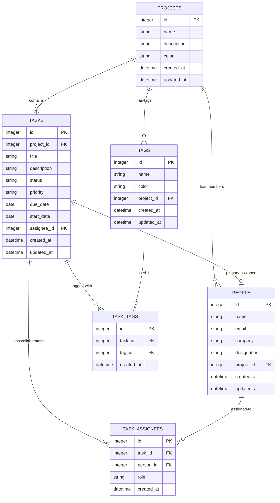
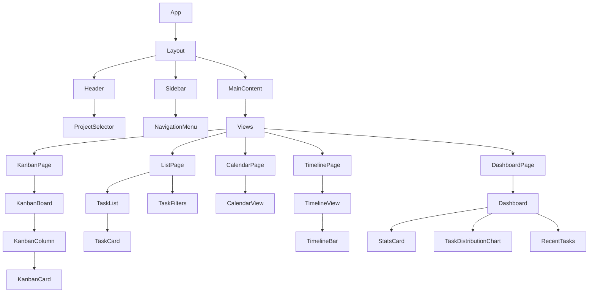
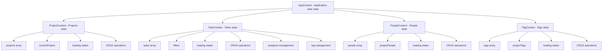
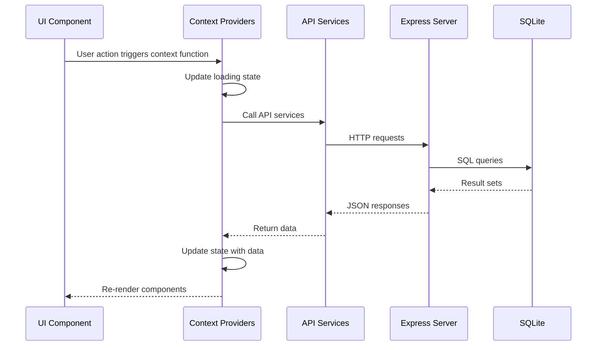
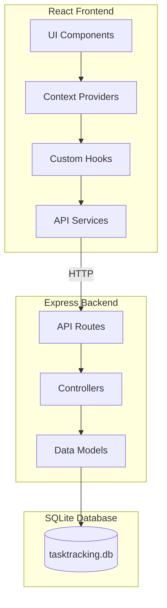
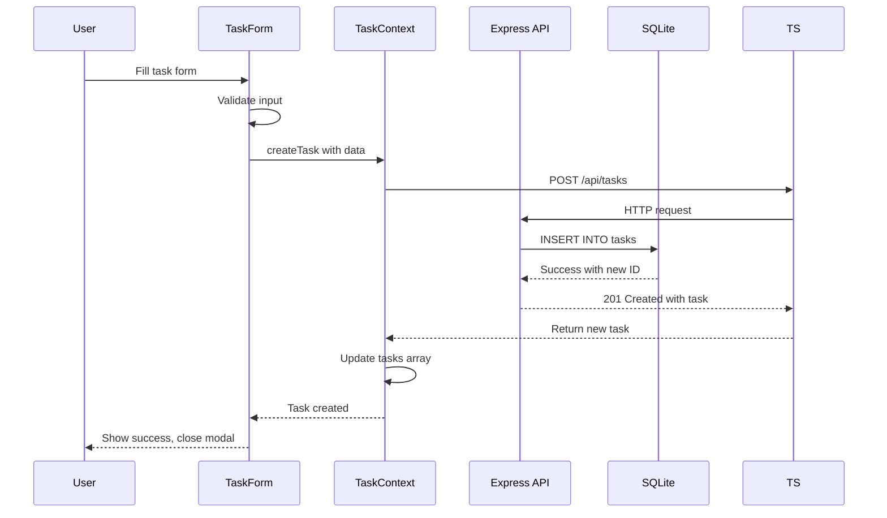
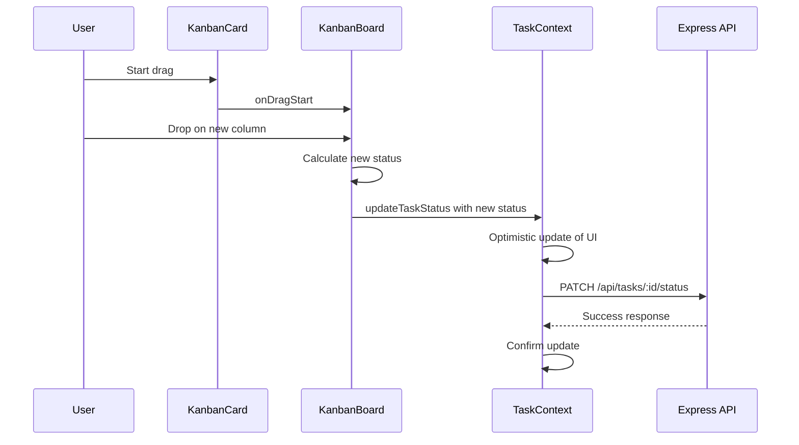

# Architecture Document: Project Management Application

A comprehensive architecture guide for a single-user, local-first project management web application similar to Jira.

---

## Table of Contents

1. [Overview](#overview)
2. [Technology Stack](#technology-stack)
3. [Project Structure](#project-structure)
4. [Database Schema](#database-schema)
5. [API Endpoints](#api-endpoints)
6. [Component Hierarchy](#component-hierarchy)
7. [State Management Strategy](#state-management-strategy)
8. [View Specifications](#view-specifications)
9. [Data Flow Diagrams](#data-flow-diagrams)

---

## Overview

This application is a **local-first, single-user** project management tool designed to work offline with all data stored locally in SQLite. It provides multiple views for task management including Kanban board, List view, Calendar view, Timeline/Gantt view, and a Dashboard.

### Key Principles
- **Local-first**: All data stored locally, no external dependencies
- **Single-user**: No authentication/authorization complexity
- **Responsive**: Works on desktop and mobile devices
- **Offline-capable**: Full functionality without internet connection

---

## Technology Stack

### Frontend

| Package | Version | Purpose |
|---------|---------|---------|
| `react` | ^18.2.0 | UI library |
| `react-dom` | ^18.2.0 | React DOM rendering |
| `react-router-dom` | ^6.20.0 | Client-side routing |
| `@dnd-kit/core` | ^6.1.0 | Drag and drop for Kanban |
| `@dnd-kit/sortable` | ^8.0.0 | Sortable drag and drop |
| `@dnd-kit/utilities` | ^3.2.2 | DnD utility functions |
| `date-fns` | ^2.30.0 | Date manipulation |
| `react-big-calendar` | ^1.8.5 | Calendar view |
| `recharts` | ^2.10.0 | Dashboard charts |
| `lucide-react` | ^0.294.0 | Icon library |
| `tailwindcss` | ^3.3.5 | CSS framework |
| `clsx` | ^2.0.0 | Conditional class names |
| `uuid` | ^9.0.1 | Unique ID generation |

### Backend

| Package | Version | Purpose |
|---------|---------|---------|
| `express` | ^4.18.2 | Web framework |
| `cors` | ^2.8.5 | CORS middleware |
| `better-sqlite3` | ^9.2.2 | SQLite database driver |
| `uuid` | ^9.0.1 | Unique ID generation |

### Development Tools

| Package | Version | Purpose |
|---------|---------|---------|
| `vite` | ^5.0.0 | Build tool and dev server |
| `@types/react` | ^18.2.0 | React TypeScript types |
| `typescript` | ^5.3.0 | TypeScript compiler |
| `eslint` | ^8.55.0 | Code linting |
| `prettier` | ^3.1.0 | Code formatting |
| `concurrently` | ^8.2.2 | Run multiple dev servers |
| `nodemon` | ^3.0.2 | Node.js auto-restart |

---

## Project Structure

```
task-tracking/
├── package.json                    # Root package.json for scripts
├── ARCHITECTURE.md                 # This document
├── README.md                       # Project documentation
│
├── client/                         # Frontend React application
│   ├── package.json
│   ├── vite.config.ts
│   ├── tsconfig.json
│   ├── tailwind.config.js
│   ├── postcss.config.js
│   ├── index.html
│   │
│   ├── public/
│   │   └── favicon.ico
│   │
│   └── src/
│       ├── main.tsx               # Application entry point
│       ├── App.tsx                # Root component with routing
│       ├── index.css              # Global styles + Tailwind
│       │
│       ├── components/
│       │   ├── common/
│       │   │   ├── Button.tsx
│       │   │   ├── Input.tsx
│       │   │   ├── Select.tsx
│       │   │   ├── Modal.tsx
│       │   │   ├── Badge.tsx
│       │   │   ├── Card.tsx
│       │   │   ├── Dropdown.tsx
│       │   │   ├── EmptyState.tsx
│       │   │   └── LoadingSpinner.tsx
│       │   │
│       │   ├── layout/
│       │   │   ├── Header.tsx
│       │   │   ├── Sidebar.tsx
│       │   │   ├── Layout.tsx
│       │   │   └── ProjectSelector.tsx
│       │   │
│       │   ├── tasks/
│       │   │   ├── TaskCard.tsx
│       │   │   ├── TaskForm.tsx
│       │   │   ├── TaskDetail.tsx
│       │   │   ├── TaskList.tsx
│       │   │   ├── TaskFilters.tsx
│       │   │   └── PriorityBadge.tsx
│       │   │
│       │   ├── kanban/
│       │   │   ├── KanbanBoard.tsx
│       │   │   ├── KanbanColumn.tsx
│       │   │   └── KanbanCard.tsx
│       │   │
│       │   ├── calendar/
│       │   │   └── CalendarView.tsx
│       │   │
│       │   ├── timeline/
│       │   │   ├── TimelineView.tsx
│       │   │   ├── TimelineBar.tsx
│       │   │   └── TimelineHeader.tsx
│       │   │
│       │   ├── dashboard/
│       │   │   ├── Dashboard.tsx
│       │   │   ├── StatsCard.tsx
│       │   │   ├── TaskDistributionChart.tsx
│       │   │   └── RecentTasks.tsx
│       │   │
│       │   └── projects/
│       │       ├── ProjectList.tsx
│       │       ├── ProjectForm.tsx
│       │       └── ProjectCard.tsx
│       │
│       ├── views/
│       │   ├── KanbanPage.tsx
│       │   ├── ListPage.tsx
│       │   ├── CalendarPage.tsx
│       │   ├── TimelinePage.tsx
│       │   └── DashboardPage.tsx
│       │
│       ├── context/
│       │   ├── AppContext.tsx
│       │   ├── ProjectContext.tsx
│       │   ├── TaskContext.tsx       # Core tasks
│       │   ├── PeopleContext.tsx      # Task assignees/people
│       │   ├── TagContext.tsx         # Tags/categories
│       │   └── AuthContext.tsx        # Authentication (future)
│       │
│       ├── hooks/
│       │   ├── useProjects.ts
│       │   ├── useTasks.ts
│       │   ├── useLocalStorage.ts
│       │   └── useDebounce.ts
│       │
│       ├── services/
│       │   ├── api.ts              # API client
│       │   ├── projectService.ts
│       │   ├── taskService.ts        # Core task services
│       │   ├── assigneeService.ts    # Assignee management
│       │   ├── tagService.ts         # Tag management
│       │   └── taskAssigneesService.ts  # Task assignee
│       │                             # - personId * 100
│       │                             # + role enum field
│       │                             # + created_at + updated_at
│       │
│       ├── types/
│       │   ├── index.ts
│       │   ├── project.ts
│       │   ├── task.ts
│       │   └── api.ts
│       │
│       └── utils/
│           ├── dateUtils.ts
│           ├── constants.ts
│           └── helpers.ts
│
├── server/                         # Backend Express application
│   ├── package.json
│   ├── tsconfig.json
│   │
│   ├── src/
│   │   ├── index.ts               # Server entry point
│   │   ├── app.ts                 # Express app configuration
│   │   │
│   │   ├── database/
│   │   │   ├── db.ts              # SQLite connection
│   │   │   ├── schema.sql         # Database schema
│   │   │   └── seed.ts            # Initial seed data
│   │   │
│   │   ├── routes/
│   │   │   ├── index.ts           # Route aggregator
│   │   │   ├── projects.ts        # Project routes
│   │   │   └── tasks.ts           # Task routes
│   │   │
│   │   ├── controllers/
│   │   │   ├── projectController.ts
│   │   │   └── taskController.ts
│   │   │
│   │   ├── models/
│   │   │   ├── projectModel.ts
│   │   │   └── taskModel.ts
│   │   │
│   │   ├── middleware/
│   │   │   └── errorHandler.ts
│   │   │
│   │   └── types/
│   │       └── index.ts
│   │
│   └── data/
│       └── tasktracking.db        # SQLite database file
│
└── scripts/
    ├── dev.sh                      # Start development servers
    └── build.sh                    # Build for production
```

---

## Database Schema

### Entity Relationship Diagram



### SQL Schema

```sql
-- Projects table
CREATE TABLE IF NOT EXISTS projects (
    id INTEGER PRIMARY KEY AUTOINCREMENT,
    name TEXT NOT NULL,
    description TEXT,
    color TEXT DEFAULT '#3B82F6',
    created_at DATETIME DEFAULT CURRENT_TIMESTAMP,
    updated_at DATETIME DEFAULT CURRENT_TIMESTAMP
);

-- Tasks table
CREATE TABLE IF NOT EXISTS tasks (
    id INTEGER PRIMARY KEY AUTOINCREMENT,
    project_id INTEGER NOT NULL,
    title TEXT NOT NULL,
    description TEXT,
    status TEXT DEFAULT 'todo',
    priority TEXT DEFAULT 'medium',
    due_date DATE,
    start_date DATE,
    assignee_id INTEGER,
    created_at DATETIME DEFAULT CURRENT_TIMESTAMP,
    updated_at DATETIME DEFAULT CURRENT_TIMESTAMP,
    FOREIGN KEY (project_id) REFERENCES projects(id) ON DELETE CASCADE,
    FOREIGN KEY (assignee_id) REFERENCES people(id) ON DELETE SET NULL
);

-- People table
CREATE TABLE IF NOT EXISTS people (
    id INTEGER PRIMARY KEY AUTOINCREMENT,
    name TEXT NOT NULL,
    email TEXT,
    company TEXT,
    designation TEXT,
    project_id INTEGER,
    created_at DATETIME DEFAULT CURRENT_TIMESTAMP,
    updated_at DATETIME DEFAULT CURRENT_TIMESTAMP,
    FOREIGN KEY (project_id) REFERENCES projects(id) ON DELETE SET NULL
);

-- Tags table
CREATE TABLE IF NOT EXISTS tags (
    id INTEGER PRIMARY KEY AUTOINCREMENT,
    name TEXT NOT NULL,
    color TEXT DEFAULT '#6B7280',
    project_id INTEGER,
    created_at DATETIME DEFAULT CURRENT_TIMESTAMP,
    updated_at DATETIME DEFAULT CURRENT_TIMESTAMP,
    FOREIGN KEY (project_id) REFERENCES projects(id) ON DELETE CASCADE
);

-- Task Assignees table - for co-assignees/collaborators
CREATE TABLE IF NOT EXISTS task_assignees (
    id INTEGER PRIMARY KEY AUTOINCREMENT,
    task_id INTEGER NOT NULL,
    person_id INTEGER NOT NULL,
    role TEXT DEFAULT 'collaborator',
    created_at DATETIME DEFAULT CURRENT_TIMESTAMP,
    FOREIGN KEY (task_id) REFERENCES tasks(id) ON DELETE CASCADE,
    FOREIGN KEY (person_id) REFERENCES people(id) ON DELETE CASCADE,
    UNIQUE(task_id, person_id)
);

-- Task Tags junction table
CREATE TABLE IF NOT EXISTS task_tags (
    id INTEGER PRIMARY KEY AUTOINCREMENT,
    task_id INTEGER NOT NULL,
    tag_id INTEGER NOT NULL,
    created_at DATETIME DEFAULT CURRENT_TIMESTAMP,
    FOREIGN KEY (task_id) REFERENCES tasks(id) ON DELETE CASCADE,
    FOREIGN KEY (tag_id) REFERENCES tags(id) ON DELETE CASCADE,
    UNIQUE(task_id, tag_id)
);

-- Indexes for performance
CREATE INDEX IF NOT EXISTS idx_tasks_project_id ON tasks(project_id);
CREATE INDEX IF NOT EXISTS idx_tasks_status ON tasks(status);
CREATE INDEX IF NOT EXISTS idx_tasks_priority ON tasks(priority);
CREATE INDEX IF NOT EXISTS idx_tasks_due_date ON tasks(due_date);
CREATE INDEX IF NOT EXISTS idx_tasks_assignee_id ON tasks(assignee_id);
CREATE INDEX IF NOT EXISTS idx_people_project_id ON people(project_id);
CREATE INDEX IF NOT EXISTS idx_tags_project_id ON tags(project_id);
CREATE INDEX IF NOT EXISTS idx_task_assignees_task_id ON task_assignees(task_id);
CREATE INDEX IF NOT EXISTS idx_task_assignees_person_id ON task_assignees(person_id);
CREATE INDEX IF NOT EXISTS idx_task_tags_task_id ON task_tags(task_id);
CREATE INDEX IF NOT EXISTS idx_task_tags_tag_id ON task_tags(tag_id);
```

### TypeScript Interfaces

```typescript
// types/project.ts
interface Project {
  id: number;
  name: string;
  description: string | null;
  color: string;
  created_at: string;
  updated_at: string;
}

// types/task.ts
type TaskStatus = 'backlog' | 'todo' | 'in_progress' | 'review' | 'done';
type TaskPriority = 'low' | 'medium' | 'high' | 'urgent';

interface Task {
  id: number;
  project_id: number;
  title: string;
  description: string | null;
  status: TaskStatus;
  priority: TaskPriority;
  due_date: string | null;
  start_date: string | null;
  assignee_id: number | null;
  created_at: string;
  updated_at: string;
  // Populated fields from joins
  assignee?: Person | null;
  co_assignees?: Person[];
  tags?: Tag[];
}

// types/person.ts
interface Person {
  id: number;
  name: string;
  email: string | null;
  company: string | null;
  designation: string | null;
  project_id: number | null;
  created_at: string;
  updated_at: string;
  // Populated field
  project?: Project | null;
}

// types/tag.ts
interface Tag {
  id: number;
  name: string;
  color: string;
  project_id: number | null;
  created_at: string;
  updated_at: string;
  // Populated field
  project?: Project | null;
}

// types/task-assignee.ts
type AssigneeRole = 'collaborator' | 'reviewer' | 'observer';

interface TaskAssignee {
  id: number;
  task_id: number;
  person_id: number;
  role: AssigneeRole;
  created_at: string;
  // Populated field
  person?: Person;
}

// types/task-tag.ts
interface TaskTag {
  id: number;
  task_id: number;
  tag_id: number;
  created_at: string;
  // Populated field
  tag?: Tag;
}

// Create/Update DTOs
interface CreatePersonDTO {
  name: string;
  email?: string;
  company?: string;
  designation?: string;
  project_id?: number;
}

interface UpdatePersonDTO {
  name?: string;
  email?: string;
  company?: string;
  designation?: string;
  project_id?: number | null;
}

interface CreateTagDTO {
  name: string;
  color?: string;
  project_id?: number;
}

interface UpdateTagDTO {
  name?: string;
  color?: string;
  project_id?: number | null;
}

interface AssignPersonDTO {
  person_id: number;
  role?: AssigneeRole;
}

interface TagTaskDTO {
  tag_id: number;
}

// Extended Task Filters
interface TaskFilters {
  project_id?: number;
  status?: TaskStatus;
  priority?: TaskPriority;
  due_date_from?: string;
  due_date_to?: string;
  search?: string;
  assignee_id?: number;
  tag_id?: number;
}
```

---

## API Endpoints

### Base URL
```
http://localhost:3001/api
```

### Projects API

| Method | Endpoint | Description |
|--------|----------|-------------|
| GET | `/projects` | Get all projects |
| GET | `/projects/:id` | Get single project |
| POST | `/projects` | Create new project |
| PUT | `/projects/:id` | Update project |
| DELETE | `/projects/:id` | Delete project |
| GET | `/projects/:id/tasks` | Get all tasks for a project |

#### Project Endpoints Detail

```typescript
// GET /api/projects
// Response: { success: true, data: Project[] }

// GET /api/projects/:id
// Response: { success: true, data: Project }

// POST /api/projects
// Body: { name: string, description?: string, color?: string }
// Response: { success: true, data: Project }

// PUT /api/projects/:id
// Body: { name?: string, description?: string, color?: string }
// Response: { success: true, data: Project }

// DELETE /api/projects/:id
// Response: { success: true, message: string }
```

### Tasks API

| Method | Endpoint | Description |
|--------|----------|-------------|
| GET | `/tasks` | Get all tasks (with optional filters) |
| GET | `/tasks/:id` | Get single task |
| POST | `/tasks` | Create new task |
| PUT | `/tasks/:id` | Update task |
| DELETE | `/tasks/:id` | Delete task |
| PATCH | `/tasks/:id/status` | Update task status only |

#### Task Endpoints Detail

```typescript
// GET /api/tasks?projectId=xxx&status=todo&priority=high
// Query params: projectId, status, priority, dueDate
// Response: { success: true, data: Task[] }

// GET /api/tasks/:id
// Response: { success: true, data: Task }

// POST /api/tasks
// Body: {
//   projectId: string,
//   title: string,
//   description?: string,
//   status?: TaskStatus,
//   priority?: TaskPriority,
//   dueDate?: string,
//   startDate?: string
// }
// Response: { success: true, data: Task }

// PUT /api/tasks/:id
// Body: Partial<Task>
// Response: { success: true, data: Task }

// PATCH /api/tasks/:id/status
// Body: { status: TaskStatus }
// Response: { success: true, data: Task }

// DELETE /api/tasks/:id
// Response: { success: true, message: string }
```

### People API

| Method | Endpoint | Description |
|--------|----------|-------------|
| GET | `/people` | Get all people (with optional project filter) |
| GET | `/people/:id` | Get single person |
| POST | `/people` | Create new person |
| PUT | `/people/:id` | Update person |
| DELETE | `/people/:id` | Delete person |

#### People Endpoints Detail

```typescript
// GET /api/people?project_id=xxx
// Query params: project_id (optional)
// Response: { success: true, data: Person[] }

// GET /api/people/:id
// Response: { success: true, data: Person }

// POST /api/people
// Body: {
//   name: string,
//   email?: string,
//   company?: string,
//   designation?: string,
//   project_id?: number
// }
// Response: { success: true, data: Person }

// PUT /api/people/:id
// Body: {
//   name?: string,
//   email?: string,
//   company?: string,
//   designation?: string,
//   project_id?: number | null
// }
// Response: { success: true, data: Person }

// DELETE /api/people/:id
// Response: { success: true, message: string }
```

### Tags API

| Method | Endpoint | Description |
|--------|----------|-------------|
| GET | `/tags` | Get all tags (with optional project filter) |
| GET | `/tags/:id` | Get single tag |
| POST | `/tags` | Create new tag |
| PUT | `/tags/:id` | Update tag |
| DELETE | `/tags/:id` | Delete tag |

#### Tags Endpoints Detail

```typescript
// GET /api/tags?project_id=xxx
// Query params: project_id (optional - returns global and project-specific tags)
// Response: { success: true, data: Tag[] }

// GET /api/tags/:id
// Response: { success: true, data: Tag }

// POST /api/tags
// Body: {
//   name: string,
//   color?: string,
//   project_id?: number (null for global tags)
// }
// Response: { success: true, data: Tag }

// PUT /api/tags/:id
// Body: {
//   name?: string,
//   color?: string,
//   project_id?: number | null
// }
// Response: { success: true, data: Tag }

// DELETE /api/tags/:id
// Response: { success: true, message: string }
```

### Task Assignees API

| Method | Endpoint | Description |
|--------|----------|-------------|
| GET | `/tasks/:id/assignees` | Get all assignees for a task |
| POST | `/tasks/:id/assignees` | Add co-assignee to task |
| DELETE | `/tasks/:id/assignees/:personId` | Remove co-assignee from task |
| PUT | `/tasks/:id/assignee` | Set primary assignee |

#### Task Assignees Endpoints Detail

```typescript
// GET /api/tasks/:id/assignees
// Response: { success: true, data: TaskAssignee[] }

// POST /api/tasks/:id/assignees
// Body: {
//   person_id: number,
//   role?: 'collaborator' | 'reviewer' | 'observer'
// }
// Response: { success: true, data: TaskAssignee }

// DELETE /api/tasks/:id/assignees/:personId
// Response: { success: true, message: string }

// PUT /api/tasks/:id/assignee
// Body: { assignee_id: number | null }
// Response: { success: true, data: Task }
```

### Task Tags API

| Method | Endpoint | Description |
|--------|----------|-------------|
| GET | `/tasks/:id/tags` | Get all tags for a task |
| POST | `/tasks/:id/tags` | Add tag to task |
| DELETE | `/tasks/:id/tags/:tagId` | Remove tag from task |

#### Task Tags Endpoints Detail

```typescript
// GET /api/tasks/:id/tags
// Response: { success: true, data: Tag[] }

// POST /api/tasks/:id/tags
// Body: { tag_id: number }
// Response: { success: true, data: TaskTag }

// DELETE /api/tasks/:id/tags/:tagId
// Response: { success: true, message: string }
```

### Error Response Format

```typescript
// Error response structure
{
  success: false,
  error: {
    code: string,
    message: string,
    details?: any
  }
}
```

---

## Component Hierarchy

### Component Tree Diagram



### Component Specifications

#### Layout Components

| Component | Props | Description |
|-----------|-------|-------------|
| `Layout` | children | Main layout wrapper with sidebar |
| `Header` | - | Top navigation bar with project selector |
| `Sidebar` | currentView, onViewChange | Left sidebar with navigation |
| `ProjectSelector` | projects, currentProject, onSelect | Dropdown to switch projects |

#### Common Components

| Component | Props | Description |
|-----------|-------|-------------|
| `Button` | variant, size, disabled, onClick, children | Reusable button component |
| `Input` | type, value, onChange, placeholder, error | Form input component |
| `Select` | options, value, onChange, placeholder | Dropdown select component |
| `Modal` | isOpen, onClose, title, children | Modal dialog component |
| `Badge` | variant, children | Status/priority badge |
| `Card` | children, className | Card container |
| `Dropdown` | trigger, items, align | Dropdown menu |
| `EmptyState` | icon, title, description | Empty data placeholder |
| `LoadingSpinner` | size | Loading indicator |

#### Task Components

| Component | Props | Description |
|-----------|-------|-------------|
| `TaskCard` | task, onClick, onEdit, onDelete | Compact task display |
| `TaskForm` | task, projectId, onSubmit, onCancel | Create/edit task form |
| `TaskDetail` | task, onClose | Full task details modal |
| `TaskList` | tasks, onTaskClick | List of task cards |
| `TaskFilters` | filters, onFilterChange | Filter controls |
| `PriorityBadge` | priority | Priority indicator |

#### Kanban Components

| Component | Props | Description |
|-----------|-------|-------------|
| `KanbanBoard` | tasks, onTaskMove | Full kanban board |
| `KanbanColumn` | status, tasks, onTaskDrop | Single column |
| `KanbanCard` | task, onClick | Draggable task card |

#### Calendar Components

| Component | Props | Description |
|-----------|-------|-------------|
| `CalendarView` | tasks, onTaskClick | Monthly calendar view |

#### Timeline Components

| Component | Props | Description |
|-----------|-------|-------------|
| `TimelineView` | tasks, onTaskClick | Gantt-style timeline |
| `TimelineBar` | task, startDate, endDate | Task bar on timeline |
| `TimelineHeader` | dateRange | Date headers |

#### Dashboard Components

| Component | Props | Description |
|-----------|-------|-------------|
| `Dashboard` | project, tasks | Main dashboard view |
| `StatsCard` | title, value, icon, trend | Single statistic card |
| `TaskDistributionChart` | tasks | Pie/bar chart for status |
| `RecentTasks` | tasks | List of recent tasks |

---

## State Management Strategy

### Overview

This application uses **React Context API** for state management. Given the single-user, local-first nature of the application, this approach provides simplicity while maintaining clean state management patterns.

### Context Structure



### Context Implementations

#### AppContext

```typescript
// context/AppContext.tsx
interface AppContextType {
  // View state
  currentView: 'kanban' | 'list' | 'calendar' | 'timeline' | 'dashboard';
  setCurrentView: (view: ViewType) => void;
  
  // UI state
  sidebarOpen: boolean;
  toggleSidebar: () => void;
  
  // Modal state
  taskModalOpen: boolean;
  selectedTask: Task | null;
  openTaskModal: (task?: Task) => void;
  closeTaskModal: () => void;
}
```

#### ProjectContext

```typescript
// context/ProjectContext.tsx
interface ProjectContextType {
  // State
  projects: Project[];
  currentProject: Project | null;
  loading: boolean;
  error: string | null;
  
  // Actions
  fetchProjects: () => Promise<void>;
  setCurrentProject: (project: Project | null) => void;
  createProject: (data: CreateProjectDTO) => Promise<Project>;
  updateProject: (id: string, data: UpdateProjectDTO) => Promise<Project>;
  deleteProject: (id: string) => Promise<void>;
}
```

#### PeopleContext

```typescript
// context/PeopleContext.tsx
interface PeopleContextType {
  // State
  people: Person[];
  projectPeople: Person[];  // People filtered by current project
  loading: boolean;
  error: string | null;
  
  // Actions
  fetchPeople: (projectId?: number) => Promise<void>;
  fetchPerson: (id: number) => Promise<Person>;
  createPerson: (data: CreatePersonDTO) => Promise<Person>;
  updatePerson: (id: number, data: UpdatePersonDTO) => Promise<Person>;
  deletePerson: (id: number) => Promise<void>;
  
  // Helpers
  getPersonById: (id: number) => Person | undefined;
  getPeopleByProject: (projectId: number) => Person[];
}
```

#### TagContext

```typescript
// context/TagContext.tsx
interface TagContextType {
  // State
  tags: Tag[];
  projectTags: Tag[];  // Tags available for current project (global + project-specific)
  loading: boolean;
  error: string | null;
  
  // Actions
  fetchTags: (projectId?: number) => Promise<void>;
  fetchTag: (id: number) => Promise<Tag>;
  createTag: (data: CreateTagDTO) => Promise<Tag>;
  updateTag: (id: number, data: UpdateTagDTO) => Promise<Tag>;
  deleteTag: (id: number) => Promise<void>;
  
  // Helpers
  getTagById: (id: number) => Tag | undefined;
  getTagsForProject: (projectId: number | null) => Tag[];
}
```

#### Extended TaskContext

```typescript
// context/TaskContext.tsx - Extended with assignee and tag support
interface TaskContextType {
  // State
  tasks: Task[];
  filteredTasks: Task[];
  loading: boolean;
  error: string | null;
  
  // Filters
  filters: TaskFilters;
  setFilters: (filters: TaskFilters) => void;
  clearFilters: () => void;
  
  // Task CRUD
  fetchTasks: (projectId?: number) => Promise<void>;
  fetchTask: (id: number) => Promise<Task>;
  createTask: (data: CreateTaskDTO) => Promise<Task>;
  updateTask: (id: number, data: UpdateTaskDTO) => Promise<Task>;
  updateTaskStatus: (id: number, status: TaskStatus) => Promise<Task>;
  deleteTask: (id: number) => Promise<void>;
  
  // Primary Assignee Management
  setPrimaryAssignee: (taskId: number, personId: number | null) => Promise<Task>;
  
  // Co-Assignee Management
  fetchCoAssignees: (taskId: number) => Promise<Person[]>;
  addCoAssignee: (taskId: number, personId: number, role?: AssigneeRole) => Promise<TaskAssignee>;
  removeCoAssignee: (taskId: number, personId: number) => Promise<void>;
  
  // Tag Management
  fetchTaskTags: (taskId: number) => Promise<Tag[]>;
  addTagToTask: (taskId: number, tagId: number) => Promise<TaskTag>;
  removeTagFromTask: (taskId: number, tagId: number) => Promise<void>;
}

// Extended Task Filters
interface TaskFilters {
  project_id?: number;
  status?: TaskStatus;
  priority?: TaskPriority;
  due_date_from?: string;
  due_date_to?: string;
  search?: string;
  assignee_id?: number;
  tag_id?: number;
}
```

### Data Flow Pattern



---

## View Specifications

### 1. Kanban Board View

#### Purpose
Visual task management with drag-and-drop functionality organized by status columns.

#### Features
- **Columns**: Backlog, To Do, In Progress, Review, Done
- **Drag and Drop**: Tasks can be dragged between columns to change status
- **Task Cards**: Compact view showing title, priority badge, and due date
- **Quick Actions**: Click to view details, right-click for context menu
- **Column Statistics**: Show count of tasks per column

#### Component Structure

```typescript
// KanbanBoard.tsx
interface KanbanBoardProps {
  tasks: Task[];
  onTaskMove: (taskId: string, newStatus: TaskStatus) => void;
  onTaskClick: (task: Task) => void;
}

// Column configuration
const KANBAN_COLUMNS: { status: TaskStatus; label: string; color: string }[] = [
  { status: 'backlog', label: 'Backlog', color: '#6B7280' },
  { status: 'todo', label: 'To Do', color: '#3B82F6' },
  { status: 'in_progress', label: 'In Progress', color: '#F59E0B' },
  { status: 'review', label: 'Review', color: '#8B5CF6' },
  { status: 'done', label: 'Done', color: '#10B981' },
];
```

#### Drag and Drop Implementation
Using `@dnd-kit` library:
- `DndContext` wraps the board
- `useSortable` hook for draggable cards
- `useDroppable` hook for columns
- Visual feedback during drag operations

---

### 2. List View

#### Purpose
Traditional tabular view of tasks with comprehensive filtering and sorting capabilities.

#### Features
- **Sortable Columns**: Click headers to sort by any field
- **Filter Panel**: Filter by status, priority, project, due date range
- **Search**: Full-text search on title and description
- **Bulk Selection**: Select multiple tasks for bulk operations
- **Inline Editing**: Quick edit of title and status
- **Pagination**: Handle large task lists efficiently

#### Table Columns

| Column | Sortable | Filterable | Description |
|--------|----------|------------|-------------|
| Checkbox | No | No | Bulk selection |
| Title | Yes | Search | Task title |
| Status | Yes | Dropdown | Current status |
| Priority | Yes | Dropdown | Priority level |
| Due Date | Yes | Date range | Task due date |
| Project | Yes | Dropdown | Parent project |
| Actions | No | No | Edit/Delete buttons |

#### Component Structure

```typescript
// TaskFilters.tsx
interface TaskFiltersProps {
  filters: TaskFilters;
  onFilterChange: (filters: TaskFilters) => void;
  onClear: () => void;
}

// TaskList.tsx
interface TaskListProps {
  tasks: Task[];
  sortConfig: SortConfig;
  onSort: (key: string) => void;
  onTaskClick: (task: Task) => void;
  onTaskSelect: (taskIds: string[]) => void;
}
```

---

### 3. Calendar View

#### Purpose
Visualize tasks by their due dates in a monthly calendar format.

#### Features
- **Monthly Grid**: Standard calendar layout
- **Task Indicators**: Show tasks on their due dates
- **Color Coding**: Tasks colored by priority or project
- **Navigation**: Previous/Next month, jump to today
- **Task Preview**: Hover to see task details
- **Drag to Reschedule**: Drag tasks between dates

#### Component Structure

```typescript
// CalendarView.tsx
interface CalendarViewProps {
  tasks: Task[];
  currentDate: Date;
  onDateChange: (date: Date) => void;
  onTaskClick: (task: Task) => void;
  onTaskDrop: (taskId: string, newDate: Date) => void;
}

// Using react-big-calendar with custom styling
import { Calendar, dateFnsLocalizer } from 'react-big-calendar';
```

#### Event Mapping

```typescript
// Map tasks to calendar events
const taskToEvent = (task: Task): CalendarEvent => ({
  id: task.id,
  title: task.title,
  start: new Date(task.dueDate),
  end: new Date(task.dueDate),
  resource: task, // Original task data
});
```

---

### 4. Timeline/Gantt View

#### Purpose
Visualize task durations and dependencies across a horizontal timeline.

#### Features
- **Timeline Header**: Days/Weeks/Months scale
- **Task Bars**: Horizontal bars showing task duration
- **Today Marker**: Vertical line indicating current date
- **Zoom Levels**: Day/Week/Month view
- **Drag to Resize**: Adjust task start/end dates
- **Project Grouping**: Group tasks by project
- **Progress Indication**: Show completion percentage

#### Component Structure

```typescript
// TimelineView.tsx
interface TimelineViewProps {
  tasks: Task[];
  dateRange: { start: Date; end: Date };
  zoomLevel: 'day' | 'week' | 'month';
  onZoomChange: (level: ZoomLevel) => void;
  onTaskClick: (task: Task) => void;
  onTaskResize: (taskId: string, startDate: Date, endDate: Date) => void;
}

// TimelineBar.tsx
interface TimelineBarProps {
  task: Task;
  position: { left: number; width: number };
  onClick: () => void;
}
```

#### Timeline Layout

```
|  January 2024  |  February 2024  |  March 2024  |
| W1 | W2 | W3 | W4 | W1 | W2 | W3 | W4 | W1 | W2 |
|----|----|----|----|----|----|----|----|----|----|
| ████████████ |                  |              |  Task 1
|              |  ████████████████|              |  Task 2
|        ████████████ |           |              |  Task 3
             ↑
           Today
```

---

### 5. Dashboard View

#### Purpose
Provide an at-a-glance overview of project status, statistics, and recent activity.

#### Features
- **Statistics Cards**: Total tasks, completed, overdue, in progress
- **Task Distribution**: Pie chart showing status breakdown
- **Priority Distribution**: Bar chart showing priority levels
- **Recent Tasks**: List of recently created/updated tasks
- **Upcoming Deadlines**: Tasks due in the next 7 days
- **Quick Actions**: Create task, switch project shortcuts

#### Component Structure

```typescript
// Dashboard.tsx
interface DashboardProps {
  project: Project | null;
  tasks: Task[];
}

// StatsCard.tsx
interface StatsCardProps {
  title: string;
  value: number | string;
  icon: React.ReactNode;
  trend?: { value: number; isPositive: boolean };
  color: string;
}

// TaskDistributionChart.tsx
interface TaskDistributionChartProps {
  tasks: Task[];
  groupBy: 'status' | 'priority';
}
```

#### Dashboard Layout

```
┌─────────────────────────────────────────────────────────────┐
│  Dashboard - Project Name                                   │
├─────────────┬─────────────┬─────────────┬─────────────────────┤
│ Total Tasks │ In Progress │  Completed  │    Overdue          │
│     42      │     12      │     25      │      3              │
├─────────────┴─────────────┴─────────────┴─────────────────────┤
│                                                               │
│  Task Distribution          │  Priority Breakdown             │
│  [Pie Chart]                │  [Bar Chart]                    │
│                             │                                 │
├─────────────────────────────┴─────────────────────────────────┤
│  Upcoming Deadlines          │  Recent Activity               │
│  • Task A - Due Tomorrow     │  • Task B was created          │
│  • Task B - Due in 3 days    │  • Task C status changed       │
│  • Task C - Due in 5 days    │  • Task D was updated          │
└──────────────────────────────┴─────────────────────────────────┘
```

---

## Data Flow Diagrams

### Application Data Flow



### Task Creation Flow



### Kanban Drag and Drop Flow



---

## Implementation Guidelines

### Development Phases

1. **Phase 1: Foundation**
   - Set up project structure
   - Configure database and run migrations
   - Implement basic API endpoints
   - Create base React components

2. **Phase 2: Core Features**
   - Implement Project CRUD
   - Implement Task CRUD
   - Build List View with filtering
   - Build Kanban Board with drag-and-drop

3. **Phase 3: Additional Views**
   - Implement Calendar View
   - Implement Timeline/Gantt View
   - Build Dashboard with charts

4. **Phase 4: Polish**
   - Responsive design refinements
   - Loading states and error handling
   - Performance optimizations
   - Testing

### Code Conventions

- **TypeScript**: Strict mode enabled, explicit types for all functions
- **Components**: Functional components with hooks
- **Styling**: Tailwind utility classes, component-level CSS only when necessary
- **File Naming**: PascalCase for components, camelCase for utilities
- **API Responses**: Consistent response format with success/error structure

### Error Handling

```typescript
// Frontend error handling pattern
try {
  const task = await taskService.createTask(data);
  // Success handling
} catch (error) {
  if (error instanceof ApiError) {
    // Show user-friendly message
    toast.error(error.message);
  } else {
    // Generic error
    toast.error('An unexpected error occurred');
  }
}

// Backend error handling middleware
app.use((err, req, res, next) => {
  console.error(err.stack);
  res.status(err.status || 500).json({
    success: false,
    error: {
      code: err.code || 'INTERNAL_ERROR',
      message: err.message || 'Internal server error',
    },
  });
});
```

---

## Appendix

### Status Values

| Status | Label | Color | Description |
|--------|-------|-------|-------------|
| `backlog` | Backlog | Gray | Tasks not yet scheduled |
| `todo` | To Do | Blue | Tasks ready to start |
| `in_progress` | In Progress | Yellow | Tasks currently being worked on |
| `review` | Review | Purple | Tasks awaiting review |
| `done` | Done | Green | Completed tasks |

### Priority Values

| Priority | Label | Color | Description |
|----------|-------|-------|-------------|
| `low` | Low | Gray | Nice to have |
| `medium` | Medium | Blue | Standard priority |
| `high` | High | Orange | Important |
| `urgent` | Urgent | Red | Critical, needs immediate attention |

### Color Palette (Projects)

Default project colors for visual distinction:
- Blue: `#3B82F6`
- Green: `#10B981`
- Purple: `#8B5CF6`
- Orange: `#F59E0B`
- Red: `#EF4444`
- Pink: `#EC4899`
- Teal: `#14B8A6`
- Indigo: `#6366F1`
